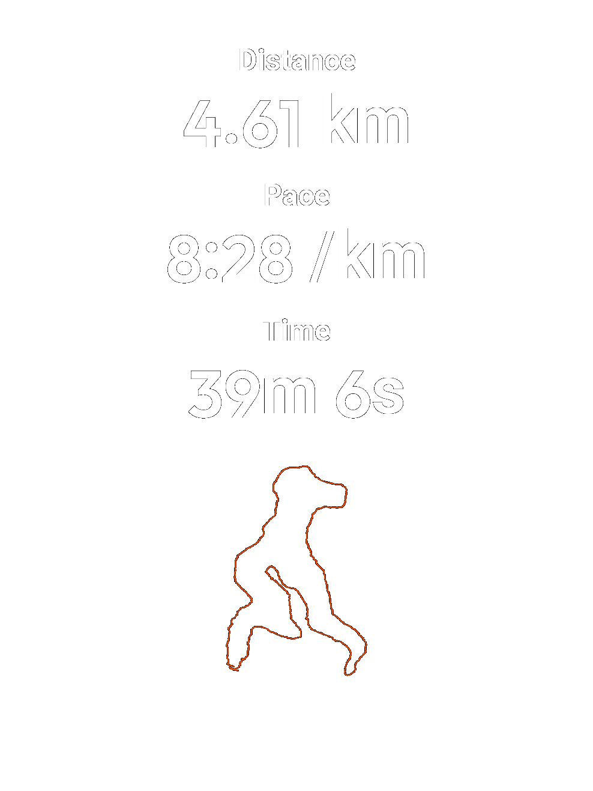
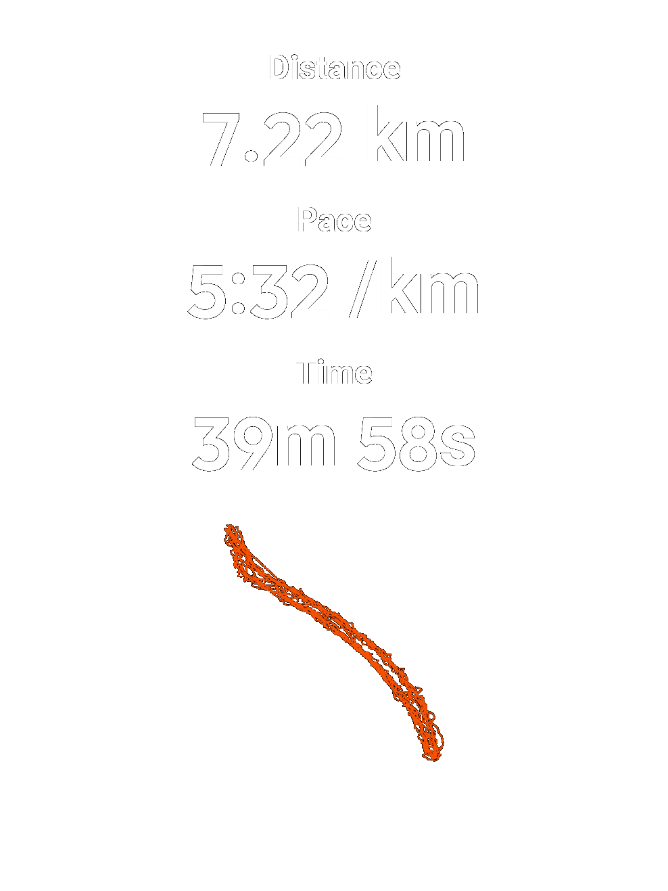
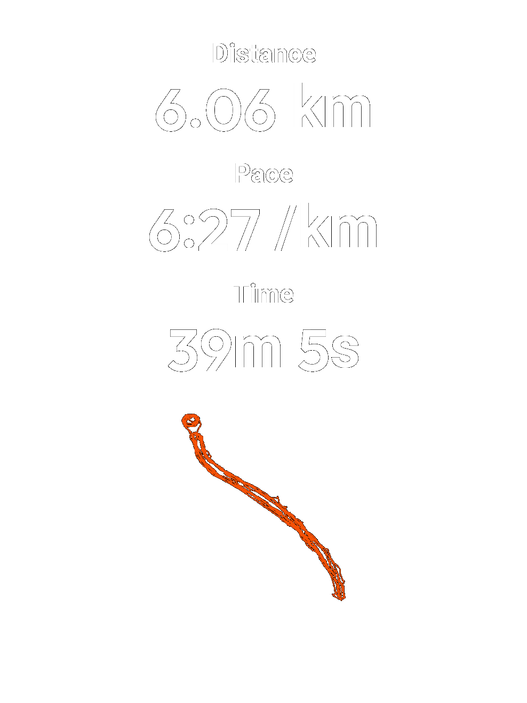
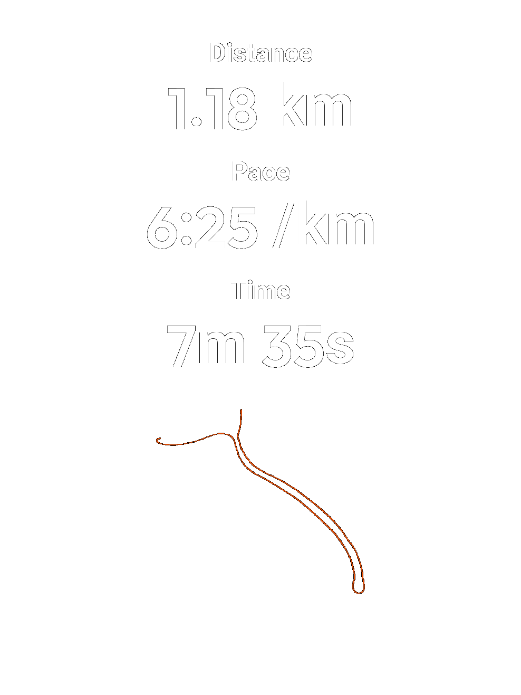
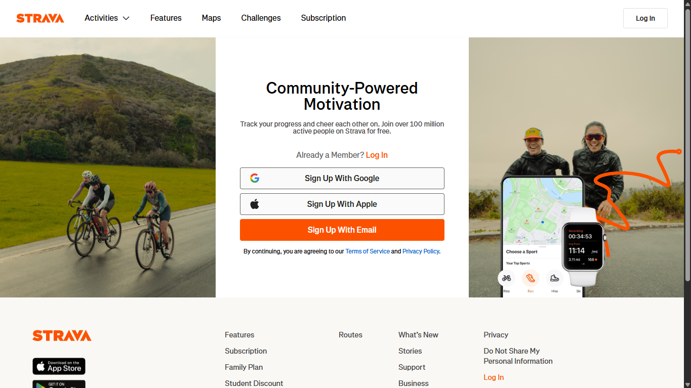
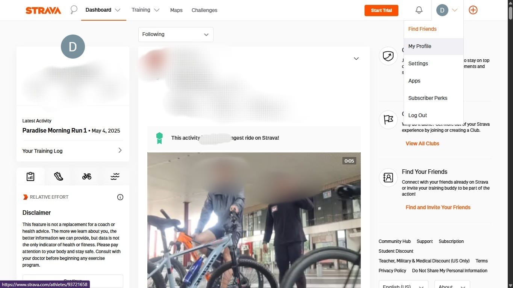
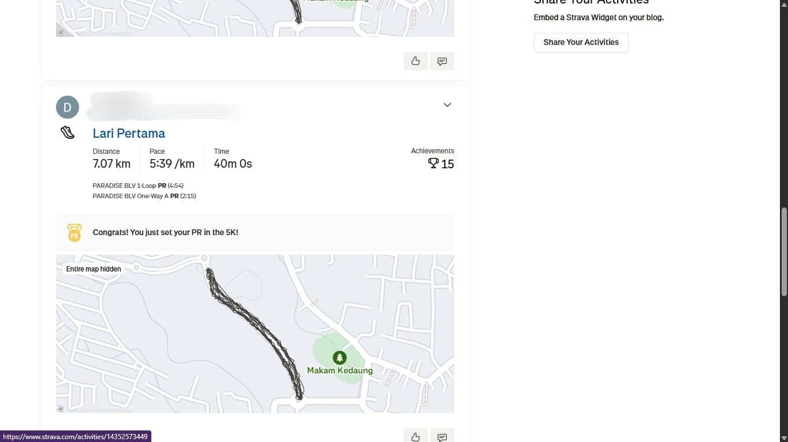
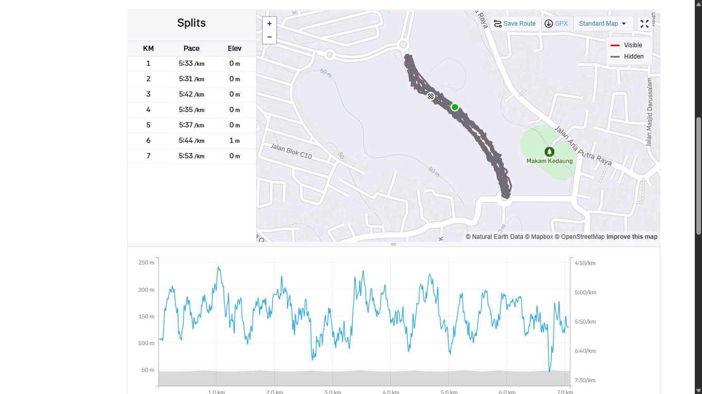

# 🏃 GPXminer – Strava-Style PNG Generator
**GPXminer** adalah alat gratis dan open-source untuk membuat gambar *summary* aktivitas lari kamu – mirip seperti tampilan premium Strava – tanpa perlu langganan berbayar.
Cukup upload file `.gpx` dari smartwatch atau aplikasi Strava kamu, dan GPXminer akan menghasilkan gambar cantik siap unggah ke Instagram Story 📱

## 🖼️ Contoh Hasil




<!-- Ganti dengan path gambar kamu -->

sebelum bisa menjalankan script ini, pastikan kamu sudah mendownload file GPX dari aktifitas di strava kamu.
## ⬇️ Cara Dowload GPX Hasil Lari di Strava
pastikan kamu melakukan ini di pc atau laptop kamu yaa!!
### 1️⃣ Login di Web Strava
Login akun strava kamu di website strava (harus di pc atau laptop) https://www.strava.com/login



### 2️⃣ Masuk ke My Profile
Arahkan kursor ke gambar profile kamu (di kanan atas) kemudian masuk ke my profile



### 3️⃣4️ Pilih Activity 
Gulir ke bawah kemudian pilih activity yang kamu mau buat PNG nya



### 4️⃣ Download GPX 
Gulir ke bawah sampai kamu melihat map hasil track lari kamu. Kemudian download GPX pada pada jendela map tersebut



Setelah berhasil download GPX. sekarang kamu siap untuk menjalankan script GPXMiner

## 📂 Struktur Proyek
```
📁 Project Root
├── 📂 Scripts                    # Folder penyimpan scripts dan kode dijalankan
│   ├── 📜 GPXMiner.py            # File Utama
│   └── 📜 Example.ipynb          # Notebook contoh untuk menggunakan script
├── 📂 Hasil                      # Folder output PNG
├── 📂 Assets                     # Folder untuk menyimpan logo dan font yang digunakan
    ├── 📂 Fonts
    │   ├── Outfit-SemiBold.ttf       ← font angka
    │   └──Roboto-Bold.ttf            ← font teks
    ├── 📂 Logos
    |   └── Strava_idOGsGeeO9_1.png   ← logo ala Strava
├── 📜 requirements.txt              ← daftar library Python
```

## 🚀 Jalankan Langsung di Google Colab
Klik tombol di bawah untuk menggunakan GPXminer tanpa install apa pun! cukup buka kemudian run all!!

[](https://colab.research.google.com/github/Jepees/GPXMiner-StravaLike/blob/main/Scripts/GPXminer_Colab.ipynb)

## 🚀 Cara Menggunakan Script (Jika kamu familiar dengan python)
### 1️⃣ **Clone Repository**  
```bash
git https://github.com/Jepees/GPXMiner-StravaLike.git
cd GPXMiner-StravaLike
```
### 2️⃣ Instalasi Dependensi
Pastikan Python 3.10+ sudah terinstall, lalu jalankan:
```bash
pip install -r requirements.txt
```
### 3️⃣ Jalankan Script
Buka file Example.ipynb, pada cell ke 3 isi gpx_path dengan path file gpx kamu
Kemudian Run All 

### 4️⃣ Hasil
Hasil PNG akan langsung pop up di jendela kamu. dan hasilnya juga akan langsung tersimpan di folder hasil

## ✨ Fitur
- Hitung otomatis jarak, waktu aktif, jeda, dan pace
- Deteksi otomatis "pause" di GPS
- Render peta lintasan dalam gaya minimalis
- Desain gambar siap unggah ke IG Story (988x1317 px)
- Bebas digunakan – tanpa iklan, tanpa biaya

## ‼️Disclaimer
- Proyek ini dibuat semata-mata untuk latihan programing python saya. Tidak ada niat untuk merugikan pihak-pihak terkait
- jarak, waktu, pace, dan perhitungan "pause" yang ditampilkan adalah hasil dari metode perhitungan saya sendiri. Harap maklum jika terdapat perbedaan antara aplikasi strava mu dengan output yang diberikan script ini


